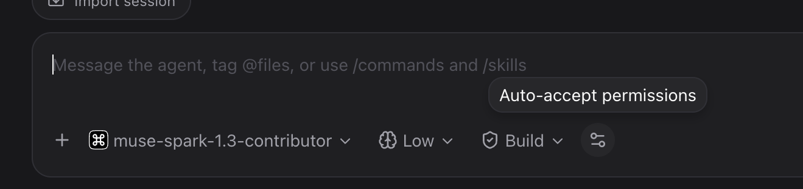
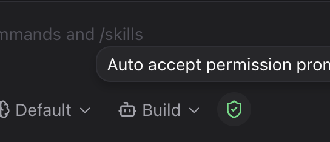

# paseo-commandcode-provider

A [Paseo](https://paseo.sh) provider plugin for [Command Code](https://commandcode.ai) (`commandcode` CLI). Requires Paseo `>=0.8.0` and `commandcode` on `PATH` (logged in via `commandcode login`) — on Windows the plugin looks for `cmdc` instead, since `commandcode` isn't guaranteed to have installed a `cmd` shim (that name is taken by the Windows shell).

To point at a different binary (a different alias, a full path, a wrapper script), either:
- Set it once for everyone under **Settings → Plugins → Command Code**, or
- Set the `COMMANDCODE_CLI_COMMAND` environment variable on a specific agent, which takes priority over the shared setting.

## Screenshots




## Install

```bash
paseo plugin add alhassanaraouf/paseo-commandcode-provider
```

Or from a local checkout:

```bash
paseo plugin install /path/to/paseo-commandcode-provider
```

Then create an agent with the **Command Code** provider.

## What works

- **Messages** — prompts run headless (`commandcode -p --output-format json`), streamed into the timeline (text, thinking, tool calls, usage).
- **Tasks** — `task_create` / `task_update` / `task_list` / `task_get` maintain a session task list shown in the Tasks pill (`todo` timeline item, like the opencode provider).
- **Models** — full live list from `commandcode --list-models` (1h cache, fallback on failure).
- **Modes** — Build / Plan (`--plan`).
- **Effort** — optional per-model selector (low/medium/high/max); omitted by default because valid levels differ per model.
- **Persistence** — native session id stored opaquely; resume via `--session`, replay on reopen.
- **Commands** (composer `/` menu, side effects via the CLI):
  - `/status`, `/info`, `/models`, `/mcp-list`
  - `/taste-list`, `/taste-learn [path|owner/repo]`
  - `/skills-list`, `/skills-add <owner/repo>`
  - `/mods-list`, `/mods-add <source>`
- **Skills** — installed skills (`commandcode skills list`) appear in the composer `/` menu and run as agent turns (`/paseo ...`), like other providers.
- Interrupt kills the running CLI process.

## Known issues

- Interactive/TTY-only features (`/usage`, `/login`, `/connect`, IDE setup) are unavailable headless — ask for them in the model prompt instead.
- Images and steering are rejected with a clear error (the CLI has no image flag or live-turn channel; v2 may use the Provider API).
- Effort levels are per-model (e.g. deepseek flash accepts only high/max) — the selector is omit-by-default so untouched sessions never error.

## Develop

```bash
npm install
npm run typecheck
npm test
paseo plugin reload commandcode-provider
paseo plugin logs commandcode-provider
```
