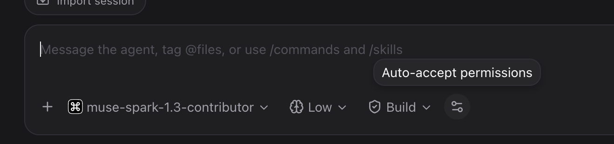
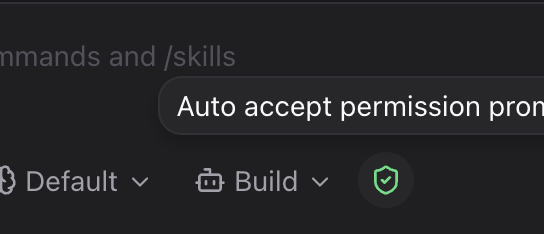

# paseo-commandcode-provider

A [Paseo](https://paseo.sh) provider plugin for [Command Code](https://commandcode.ai) (`commandcode` CLI). Requires Paseo `>=0.8.0` and `commandcode` on `PATH` (logged in via `commandcode login`) — on Windows the plugin looks for `cmdc` instead, since `commandcode` isn't guaranteed to have installed a `cmd` shim (that name is taken by the Windows shell).

To point at a different binary (a different alias, a full path, a wrapper script), either:
- Set it once for everyone under **Settings → Plugins → Command Code**, or
- Set the `COMMANDCODE_CLI_COMMAND` environment variable on a specific agent, which takes priority over the shared setting.

## Screenshots




## Install

```bash
paseo plugin add npm:@alhassanaraouf/paseo-commandcode-provider
```

Or from GitHub:

```bash
paseo plugin add alhassanaraouf/paseo-commandcode-provider
```

Or from a local checkout:

```bash
paseo plugin add /path/to/paseo-commandcode-provider
```

Then create an agent with the **Command Code** provider.

## What works

The provider talks to the **Command Code ACP server** (`commandcode acp`), the same
Agent Client Protocol interface Zed uses, via Paseo's `runAcpProvider`. That means
one long-lived session per agent instead of a fresh `-p` process per turn.

- **Messages** — streamed into the timeline as text, thinking, tool calls and usage, in the order the agent produces them.
- **Images** — sent as native ACP image blocks (`promptCapabilities.image`), so no temp file and no size dance. Requires a vision-capable model.
- **Cancel-and-continue** — sending a message while a turn runs cancels that turn (`stopReason: "cancelled"`) and continues on the same session, so context survives. This is **not** mid-turn steering: ACP rejects a concurrent prompt outright (`A prompt is already running for this session`), and partial work in the cancelled turn is lost. Paseo's ACP adapter reports `steer` as unavailable for every ACP agent, since `prompt.steer` is not among its capabilities.
- **Sessions** — `loadSession` + `session/list` give real persistence and resume; a session started in Paseo shows up in the terminal's `/resume` list.
- **Models, modes, effort** — the catalog, the five permission modes (`default`, `auto-accept`, `plan`, `dont-ask`, `bypass`) and per-model effort all arrive over ACP.
- **Permissions** — prompts surface as approve/reject with the mode shown in the UI.
- **Tasks** — the Tasks pill is fed by ACP `plan` updates. Verified: a `todo_write` turn emits `plan` entries with `pending`/`completed` statuses.
- **Slash commands** — project commands, skills and mod commands, plus `/compact`.
- Interrupt cancels the running turn (emits `canceled`, no dangling turn).

Two things the previous `-p` transport had and this one does not:

- **Session title from the first prompt.** The ACP adapter passes through whatever title the host supplies and has no fallback, so a session you never named is untitled.
- **An actionable health notice.** The old provider probed `--version` and surfaced which binary it resolved, where that came from, and `commandcode login` / `commandcode status` hints. The ACP provider defines no `status` callback, so a missing binary or a disabled ACP mod shows up as a generic spawn failure or a timeout.

### Legacy `-p` transport

`server/provider.ts` still contains the previous headless implementation (NDJSON
parsing of `commandcode -p --output-format json`, image materialization to a temp
file). It is **not registered**, and there is no setting to switch to it: both
providers claim the id `commandcode` and the host rejects duplicate provider ids.
Reaching it means editing `index.server.ts`, so treat it as reference, not a
fallback. It matters only when the ACP mod is disabled
(`{"mods": {"disabled": ["acp"]}}` makes `cmd acp` refuse to start), because then
this provider has no working transport at all.

## Known issues

- Interactive/TTY-only features (`/usage`, `/login`, `/connect`, IDE setup) are unavailable headless — ask for them in the model prompt instead.
- Paseo reports `steer` as unavailable for this provider. The built-in ACP adapter lists only `prompt.message`, `prompt.command`, `session.configure` and `permission`, so `steerActiveTurn` never sees a steer result and falls back to a fresh turn. Sending a message mid-run therefore cancels the running turn rather than injecting into it.
- Images need a vision-capable model. Over ACP the image is a native content block, but the model still has to be one that can see it.
- Effort levels are per-model, so the picker only offers the levels a model accepts.

## Develop

```bash
npm install
npm run typecheck
npm test
paseo plugin reload commandcode-provider
paseo plugin logs commandcode-provider
```
